# 🚀 CPI_API_ENRICHMENT_BASE64

## SAP BTP Integration Suite – iFlow de Enriquecimento + Base64

🎯 🧩 Objetivo do iFlow

Este iFlow tem como objetivo demonstrar um cenário de integração no SAP Integration Suite, realizando o consumo de uma API externa, o enriquecimento de dados e a manipulação do payload com codificação e decodificação em Base64, culminando na geração de uma resposta estruturada simulando um arquivo para download.

🔗 Consumo de API externa   
🧠 Enriquecimento de dados   
⚙️ Manipulação de payload com Groovy   
🔐 Codificação e decodificação em Base64   
📄 Simulação de geração de arquivo   

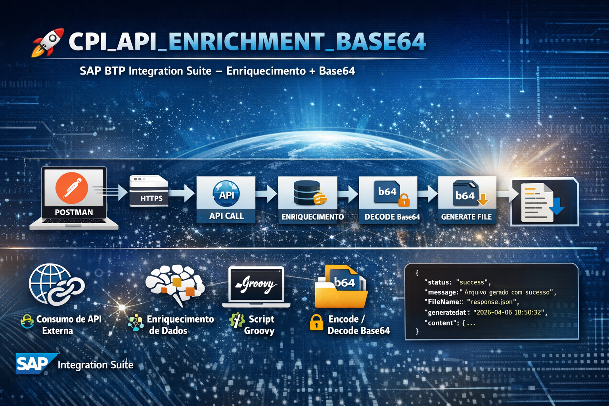

---

<br>

# 🏗️ 🔧 Arquitetura do iFlow

<br><br>

🔄 Fluxo completo   
<br>
POSTMAN → HTTPS → Content Modifier → Request Reply →   
Content Modifier → Groovy Encode → Groovy Decode →     
Content Modifier → Response Final   

<br><br>

# 🌐 🔹 1. POSTMAN

### 📥 Exemplo de Payload
```
<root>
    <id>1</id>
</root>
```
👉 Simula entrada externa (Postman ou sistema)

<br>


# 🔄 2. Fluxo da Integração

<br>

### 🧱 Criando o Package


<br><br>

### 🏷️ Nome do Package
```
ZPKG_CPI_API_ENRICHMENT_BASE64
```
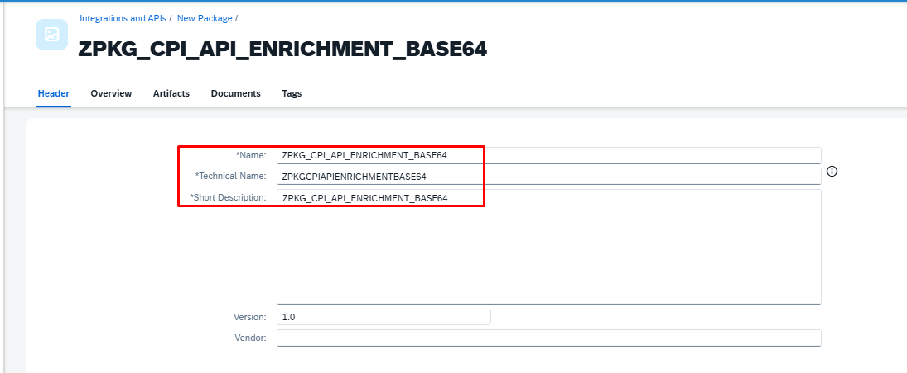

<br>

### ➕ Adicionando o Artefato
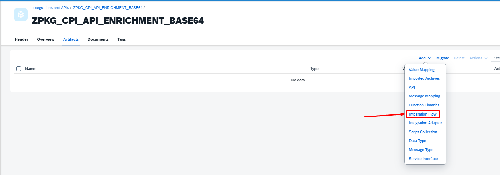

<br>

### 🏷️ Nome do iFlow
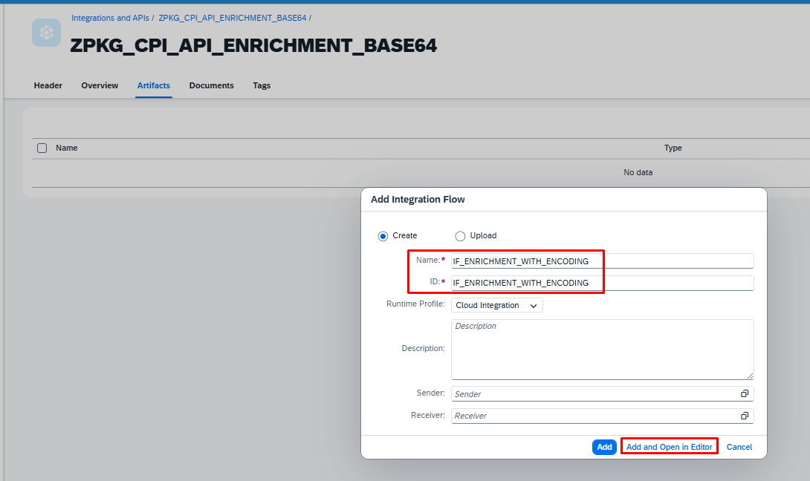
```
IF_ENRICHMENT_WITH_ENCODING
```
<br>

### ➕ Adicionando o Adapter
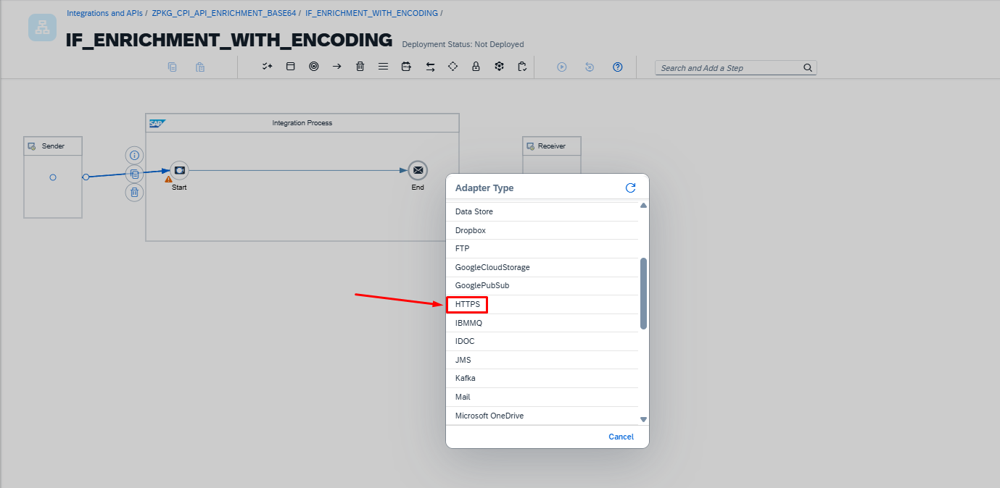


# 🔹 3. HTTPS Sender (Trigger)
```
Endpoint: /api/enrichment
```
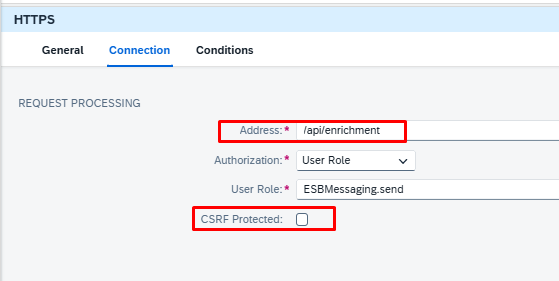

# 🔹 4. Content Modifier

### ➕ Adicionando o Content Modifier
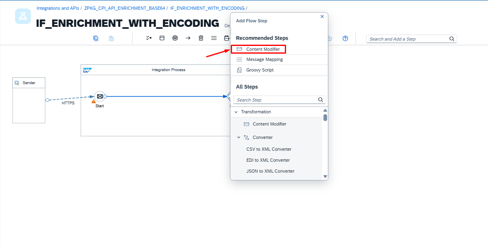

<br>

### 🏷️ Renomeando o Content Modifier
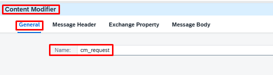
```
Nome: cm_request
```

<br>

### ⚙️ Configuração do Content Modifier
Exchange Property
```
| Campo        | Valor            |
| ------------ | ---------------- |
| Name         | id               |
| Source Type  | XPath            |
| Source Value | /root/id         |
| Data Type    | java.lang.String |
```
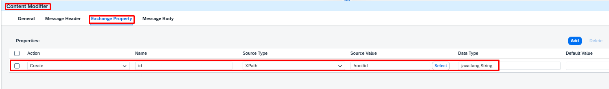

<br>

# 🔹 5. Request Reply (Chamada API)

### ➕ Adicionando Request Reply
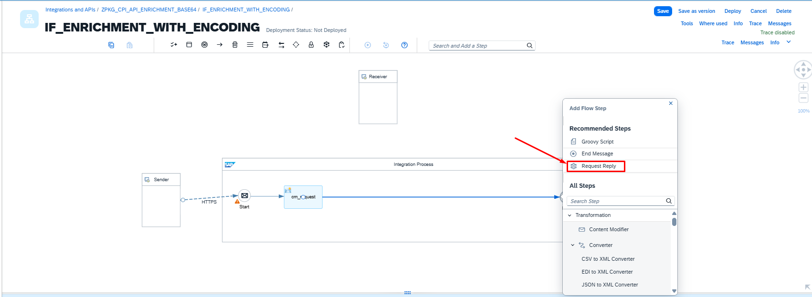

<br>

### 🏷️ Renomeando o Request Reply
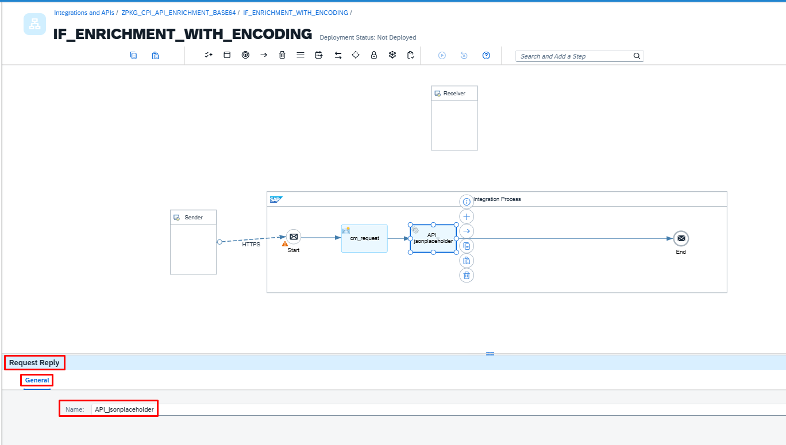
```
Nome: API_jsonplaceholder
```

<br>

### ➕ Adicionando o Adapter
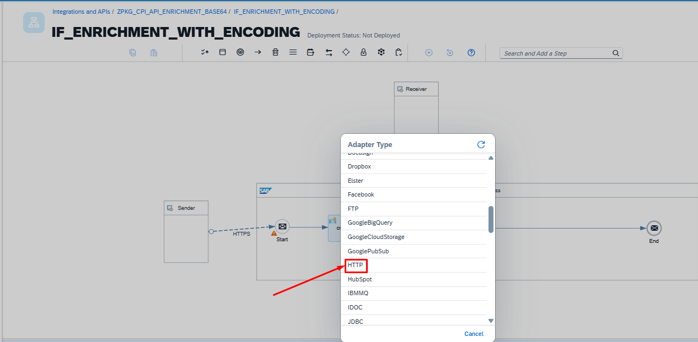

<br>

### ⚙️ Configuração do Request Reply
```
URL: https://jsonplaceholder.typicode.com/posts
Query: id=${property.id}
```
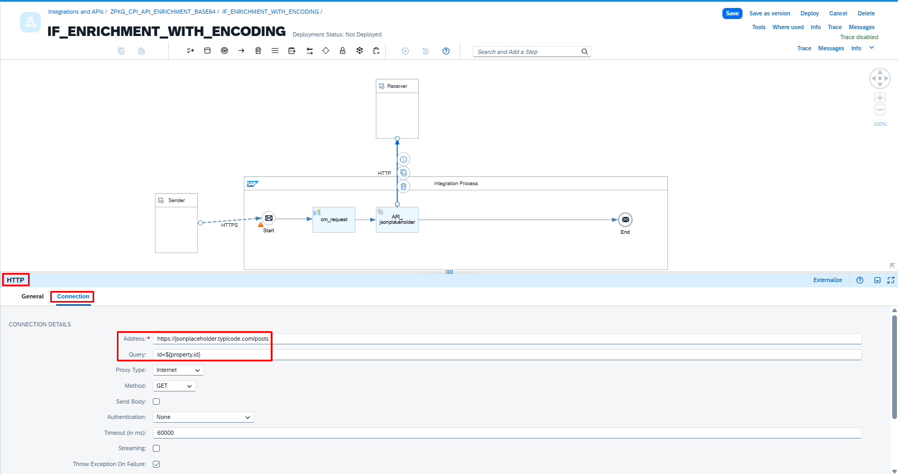

<br>

# 🔹 6. Content Modifier (Get Payload)

### ➕ Adicionando o Content Modifier
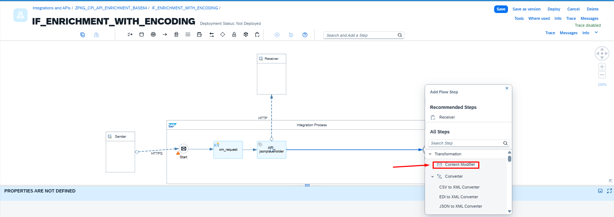

<br>

### 🏷️ Renomeando o Content Modifier
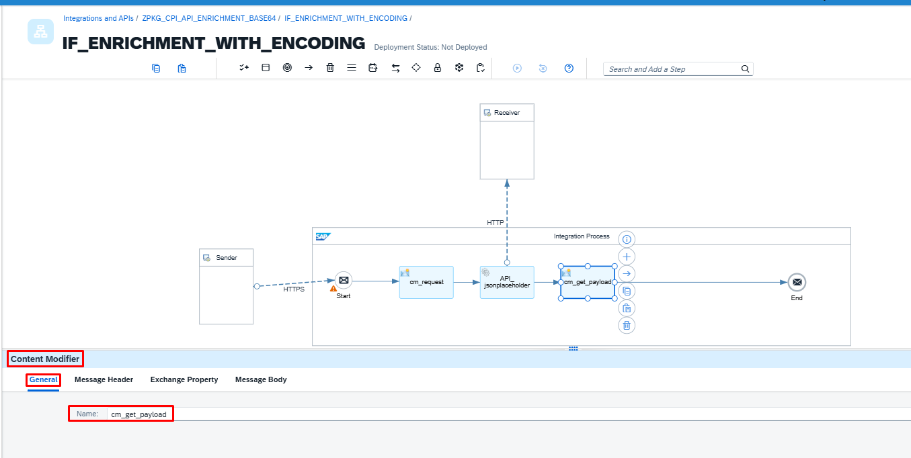
```
Nome: cm_get_payload
```

<br>

### ⚙️ Configuração do Content Modifier 
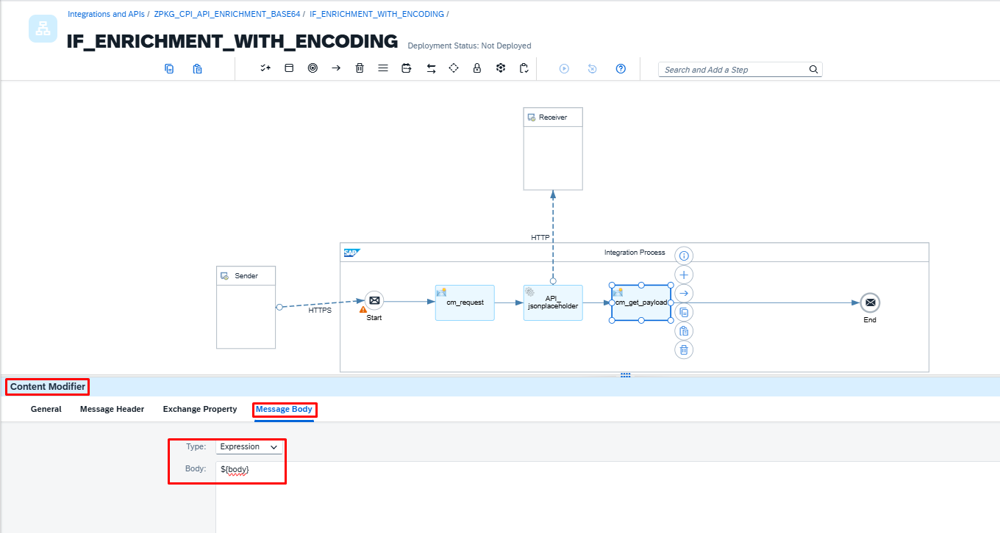
Message Body
```
Type: Expression
Body: ${body}
```
# 🔹 7. Content Modifier (Prepare Payload)

### ➕ Adicionando o Content Modifier
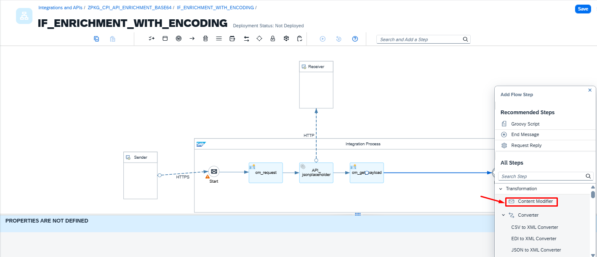

<br>

### ⚙️ Configuração do Content Modifier

General
```
Nome: cm_prepare_payload
```

Exchange Property
```
| Campo        | Valor            |
| ------------ | ---------------- |
| Name         | data             |
| Source Type  | Expression       |
| Source Value | ${body}          |
| Data Type    | java.lang.String |
```
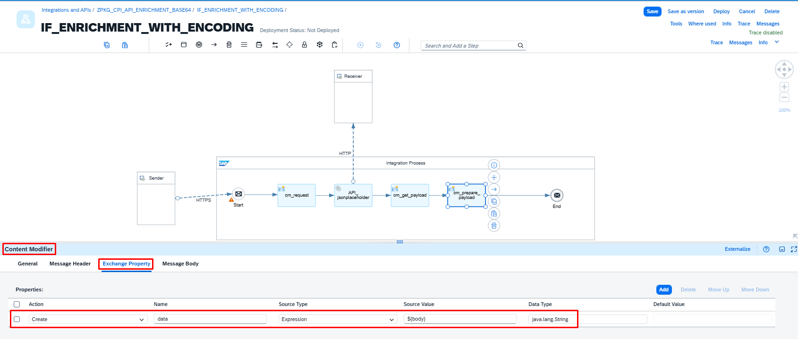

<br>

# 🔹 8. Groovy Script (ENCODER Base64)

### ➕ Adicionando o Adapter Groovy Script
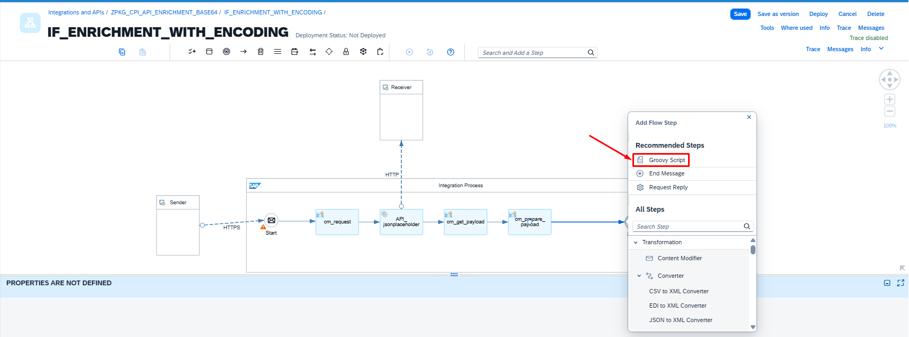

<br>

### 🏷️ Renomeando o Groovy Script
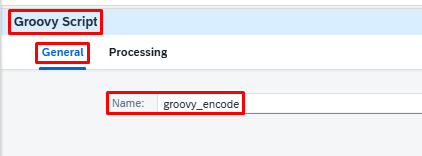
```
Nome: groovy_encode
```
### ➕ Adicionando o Groovy Script
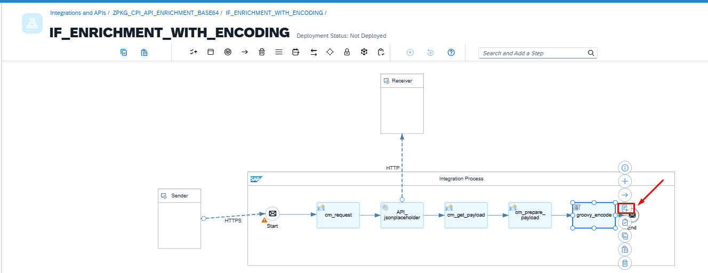

<br>

### 💻 Código do Groovy Script
```
import com.sap.gateway.ip.core.customdev.util.Message
import java.util.Base64

def Message processData(Message message) {
    def body = message.getBody(String)
    def encoded = Base64.encoder.encodeToString(body.getBytes("UTF-8"))
    message.setBody(encoded)
    return message
}
```

<br>

#🔹 9. Groovy Script (DECODER Base64)

Nome: groovy_decode

```
import com.sap.gateway.ip.core.customdev.util.Message
import java.util.Base64

def Message processData(Message message) {
    def body = message.getBody(String)
    def decoded = new String(Base64.decoder.decode(body), "UTF-8")
    message.setBody(decoded)
    return message
}
```

# 🔹 10. Content Modifier (Simular Arquivo)
Headers
```
Content-Type: application/json
```

🔹 9. Content Modifier Final

Nome: CM_Build_Final_Response

Message Header
| Header              | Tipo     | Valor                                |
| ------------------- | -------- | ------------------------------------ |
| Content-Disposition | Constant | attachment; filename="response.json" |
| Content-Type        | Constant | application/json                     |


Message Body
```
{
  "status": "success",
  "message": "Arquivo gerado com sucesso",
  "generatedAt": "${date:now:yyyy-MM-dd HH:mm:ss}",
  "fileName": "response.json",
  "content": ${body}
}
```


# 🔹 11.🎯 Resultado
```
{
    "status": "success",
    "message": "Arquivo gerado com sucesso",
    "generatedAt": "2026-04-06 18:50:32",
    "fileName": "response.json",
    "content": {
        "source": "API",
        "timestamp": "2026-04-06 18:50:32",
        "data": [
            {
                "userId": 1,
                "id": 1,
                "title": "sunt aut facere repellat provident occaecati excepturi optio reprehenderit",
                "body": "quia et suscipit\nsuscipit recusandae consequuntur expedita et cum\nreprehenderit molestiae ut ut quas totam\nnostrum rerum est autem sunt rem eveniet architecto"
            }
        ]
    }
}
```

<br>
<br>

---

## 📦 Exemplo prático – iFlow para baixar

📦 [Download do iFlow – PKG_BASE64_ENCODE_DECODE](https://github.com/souzajean/ZPKG_BASE64_ENCODE_DECODE/raw/main/Package/IFL_CPI_Base64_EncodeDecode_Service.zip)


